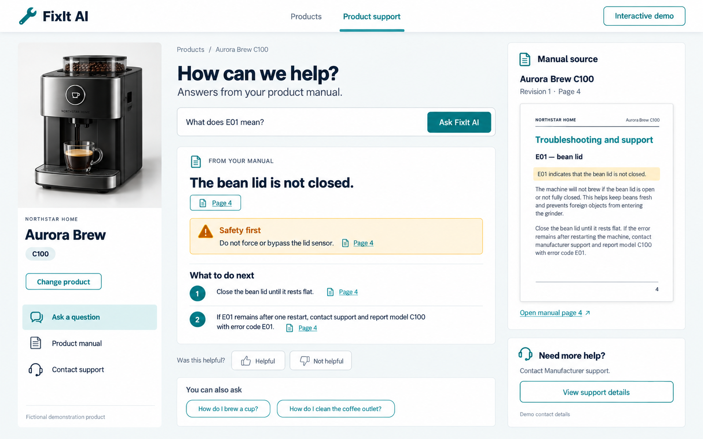

# FixIt AI

### Product support grounded in the manual—not guesswork.

FixIt AI is a portfolio project that helps product owners find clear troubleshooting and maintenance guidance from a selected product's manual, with page-level citations and an explicit safety boundary.

**Status:** Working local demonstration; Azure deployment preparation is in progress. A public live demo is not available yet. This public repository is a project showcase only—the application source code remains private.

## Experience preview

*Approved design mockup, not a screenshot of a deployed service. The implemented local experience includes product imagery, illustrated steps, cited excerpts, and links to full manual pages.*

## The problem

The same error code can mean different things on different products. Generic answers can be irrelevant or unsafe. FixIt AI keeps guidance tied to the selected model and its published manual, and declines to invent an answer when the evidence is missing.

## What the local demo demonstrates

- Six fictional product models across coffee machines, washing machines, and dishwashers, with original demonstration manuals.
- Model-specific guidance, page-level citations, and manual-source previews.
- Unsupported-question handling and escalation for requests beyond the safety boundary.
- A Manufacturer workspace for manual upload, processing, review, publication, and feedback review.
- Versioned manuals: processing a replacement does not automatically publish it.
- Repeatable offline evaluations and automated API, web, browser, and security checks.

The repeatable local demo uses a deterministic answer path. Azure-backed model and retrieval integrations are implemented separately; this showcase does not claim that the public Azure deployment or cloud indexing of all six manuals is complete.

## Architecture

| Layer | Technology and responsibility |
| --- | --- |
| Web application | Next.js, React, and TypeScript: product selection, guidance, citations, and administration |
| API | Python and FastAPI: application workflows, evidence access, and safety handling |
| Ingestion | Explicitly enabled, bounded one-shot processing; successful manuals remain ready for human review |
| Azure integration target | Azure-hosted OpenAI through Microsoft Foundry, Azure AI Search, Blob Storage, and Azure SQL |
| Hosting and identity target | Azure Container Apps, managed identities, and Microsoft Entra ID |

Cloud hosting and identity configuration still require deployment and end-to-end verification. They are not represented here as a running production service.

## Engineering priorities

- **Evidence:** Answers stay associated with the selected model and cited manual content.
- **Safety:** Hazardous requests escalate instead of receiving repair procedures.
- **Publication control:** Ingestion, review, and publication are separate operations.
- **Cost control:** Bounded processing and provider usage limits support a low-usage demo; limits are not a guarantee of zero cloud costs.
- **Verification:** CI includes tests, dependency auditing, secret scanning, and security checks. Changes pass review before merging.

## Try it

The recruiter-facing live demo link will be added here after deployment and verification. There is currently nothing to install from this showcase repository.

## About this showcase

Created by [Krishna Mvwala](https://github.com/krishnamvwala).

This repository contains only this overview and a selected design asset. It does not contain application source code, credentials, internal project tracking, or the private repository's history.

All demonstrated products and manuals are fictional portfolio materials—not instructions for operating or repairing real appliances.
